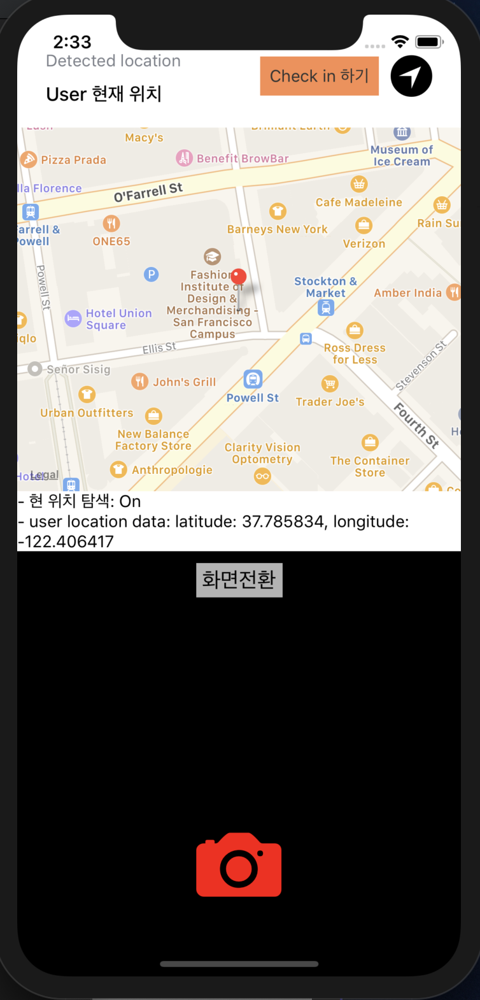

## pathhack Checkin-app

 - 2019.07.26~27, Busan, PATHHACK 에서 만들어진 간단한 위치기반 카메라 앱입니다.
 - 모바일기기의 GPS를 활용해 특정 위치에 도착하면 카메라 기능이 활성화 되어 머신러닝(Open CV)을 통한 본인 얼굴인식과 연동하고자 만들었습니다. 아직은 미완성입니다.

## 코드 스택 소개

 - 본 코드는 리액트 네이티브의 expo를 기반하여 시작하였습니다.
 (https://facebook.github.io/react-native/docs/getting-started)
 
 - package.json의 defendencies, devdefendencied를 보시면 사용된 라이브러리들이 추가 되어 있습니다.

## 코드 활용법
 - 우선 (https://facebook.github.io/react-native/docs/getting-started) 화면에 따라
   1) Node 10+ 이 설치 되어 있어야 하고, 
   2) npm install -g expo-cli을 터미널 창에 입력합니다. (-g는 전역 설치이므로 폴더 위치는 어디서      
      입력해도 무관)
   3) 이제 이 코드를 클론하여 프로젝트를 시작 할 수 있습니다.

 1. 깃 클론하여 폴더에 코드를 클론합니다.
 2. 본 코드 루트 디렉토리에 즉, app.js, package.json 등이 있는 디렉토리에서 터미널 창을 열어 
    npm install 을 입력하시면 package.json의 defendencies, devdefendencied에 적힌 라이브러리들이 설치가 됩니다.
 3. package.json 을 보시면 실행 scripts 들이 적혀 있습니다.
    터미널 창에 expo start 를 입력하면 expo 웹과 모바일을 위한 로컬 서버가 실행 됩니다.
 4. 웹 서버 창이 잘 실행 되면 
    - Starting Metro Bundler on port 19001.
    - Tunnel ready.
    가 뜨면 웹 화면 좌측에  Run on android 또는 Run on iOS 를 통해 앱을 실행 할 수 있습니다.
    
    주의) 가상 에뮬레이터로의 실행은 ios는 맥에서만 가능하며 xcode 설치가 되어 있어야합니다. 
         (https://facebook.github.io/react-native/) 참고
         android 가상 에뮬레이터 실행은 android studio 가 설치되어 있어야 하고 환경변수 설정이 필요합니다
         (https://facebook.github.io/react-native/docs/getting-started) 참고

         단, 가상 에뮬레이터가 없이도 화면에 뜨는 QR 코드를 실제 모바일 기기로 촬영하면 실제 모바일 기기에서 앱 실행이 가능합니다.
         앱 스토어나, 구글 플레이에서 'expo' 앱을 설치하고 아무 QR 코더로 qr코드를 찍으면 앱이 실행이 됩니다.

    에로사항은 (https://facebook.github.io/react-native/)를 참고하십시오~!

## ScreenShot

    

    

